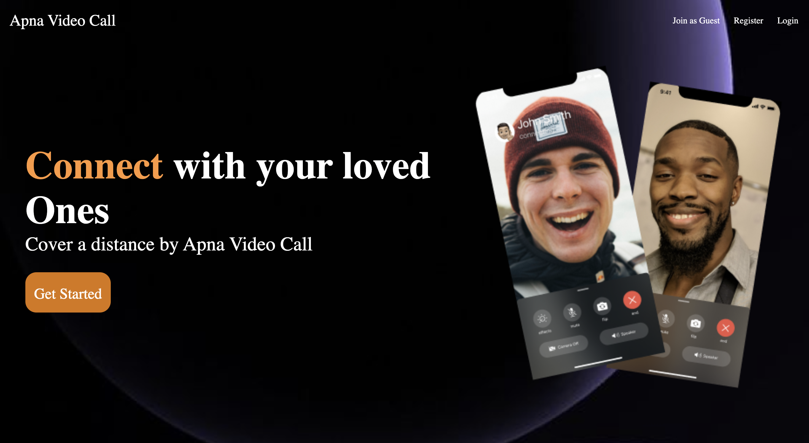
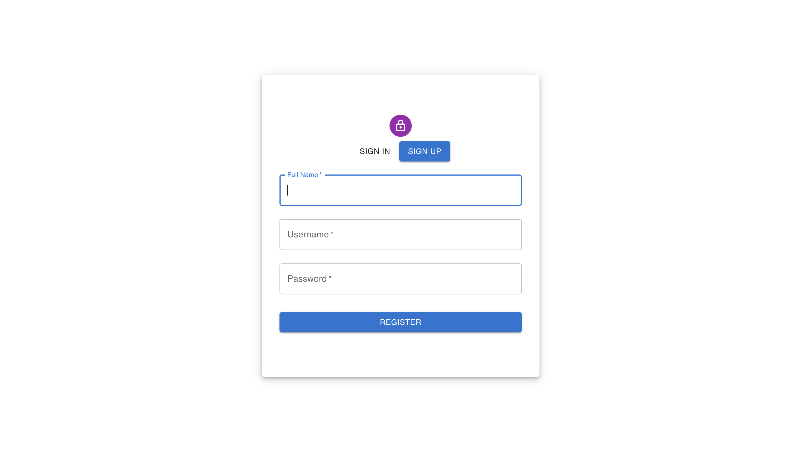
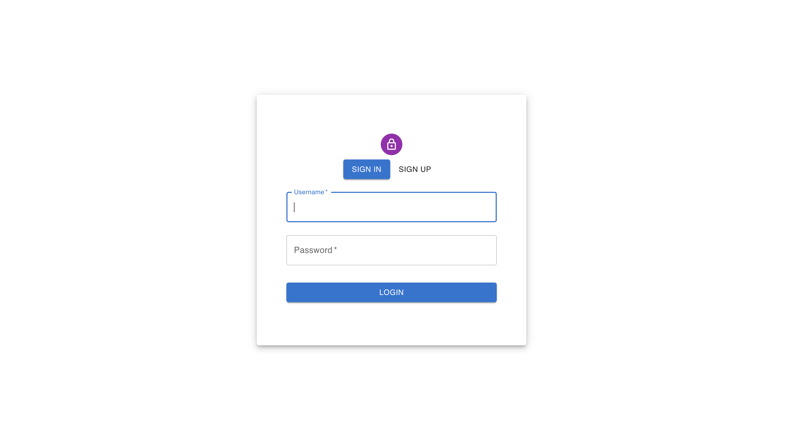
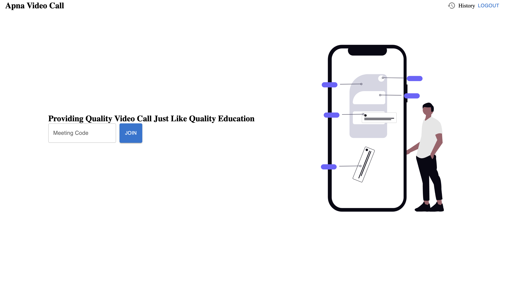

# WebRTC Video Conferencing App

A full-stack real-time video conferencing application built using React, Node.js, Express, MongoDB, Socket.io and WebRTC.

This application allows users to create or join meeting rooms, communicate through live video/audio streams, and exchange messages in real time.

## Features

- User Authentication (Register & Login)
- Secure token-based user sessions
- Create and join meeting rooms
- Real-time video conferencing using WebRTC
- Real-time chat system
- Microphone toggle
- Camera toggle
- Screen sharing support
- Meeting history tracking
- Responsive user interface

---

## Tech Stack

### Frontend

- React
- React Router DOM
- Material UI (MUI)
- Axios
- Socket.io Client

### Backend

- Node.js
- Express.js
- MongoDB
- Socket.io

### Real-Time Communication

- WebRTC
- STUN Server (Google STUN)

---

## Project Structure

```text
WebRTC-App/

├── backend/
│
│   ├── src/
│   │
│   ├── controllers/
│   │   ├── socketManager.js
│   │   └── user.controller.js
│   │
│   ├── models/
│   │   ├── meeting.model.js
│   │   └── user.model.js
│   │
│   ├── routes/
│   │   └── users.routes.js
│   │
│   └── app.js
│
├── frontend/
│
│   ├── public/
│   │   ├── background.png
│   │   ├── mobile.png
│   │   └── rightpanel.png
│   │
│   ├── src/
│   │
│   ├── contexts/
│   │   └── AuthContext.jsx
│   │
│   ├── pages/
│   │   ├── authentication.jsx
│   │   ├── history.jsx
│   │   ├── home.jsx
│   │   ├── landing.jsx
│   │   └── VideoMeet.jsx
│   │
│   ├── styles/
│   │
│   ├── utils/
│   │   └── withAuth.jsx
│   │
│   ├── App.jsx
│   └── main.jsx
```

---

## Screenshots

###  Landing Page



### SignUP Page




### SignIn Page



### Home Page




---

## Environment Variables

### Backend (.env)

```env
PORT=8000

MONGO_URL=your_mongodb_string
```

### Frontend (.env)

```env
VITE_SERVER_URL=http://localhost:8000
```

---

## Installation

### Clone Repository

```bash
git clone https://github.com/mohdtajul/sync-sphere.git
```

### Move into project directory

```bash
cd your-repository-name
```

### Install Frontend Dependencies

```bash
cd frontend

npm install
```

### Start Frontend

```bash
npm run dev
```

### Install Backend Dependencies

```bash
cd backend

npm install
```

### Start Backend Server

```bash
node src/app.js
```

---

## How It Works

1. Users create an account or log in.
2. Users enter a meeting code.
3. The meeting code is stored in user history.
4. Users join the video room.
5. Socket.io establishes signaling communication.
6. WebRTC creates peer-to-peer connections.
7. Users can communicate through video, audio and chat.

---

## Future Improvements

- Group video call optimization
- Profile management
- Meeting scheduling
- Participant list
- Notifications
- Better UI/UX improvements

---

## Author

Mohd Tajul

GitHub: https://github.com/mohdtajul